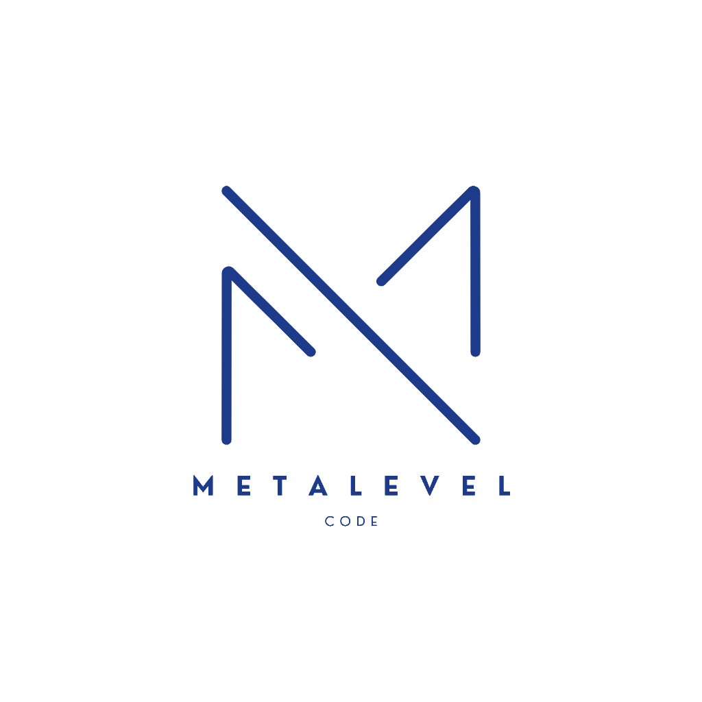

---
pdf_options:
  format: A4
  margin:
    top: 0
    right: 0
    bottom: 0
    left: 0
---

  

  
  
Propuesta Comercial Desarrollo Web B2B

  
CASA TRADICIÓN

  

    <strong>Agencia:</strong> Meta Level 
    <strong>Contacto:</strong> +57 301 7505981 
    <strong>Fecha:</strong> 08 de Octubre, 2026
  

## 1. EL ALCANCE DEL PROYECTO
Esta propuesta no contempla el uso de plantillas genéricas. Se trata de una arquitectura web construida desde cero (Código Nativo) orientada a dominar el sector B2B (HORECA).

**I. Identidad Visual Inmersiva:**
Desarrollo de un entorno digital de alta gama utilizando animaciones avanzadas (GSAP) y diseño editorial. El objetivo es vender el estatus premium de Casa Tradición, demostrando que no solo venden plátanos, sino ingeniería gastronómica.

**II. Motor B2B y Catálogo 3D:**
Espacio interactivo donde los clientes HORECA pueden explorar el portafolio. Las tarjetas de producto tendrán tecnología 3D, mostrando el empaque al vacío y la sugerencia de servido.

**III. Pasarela de Pagos (Fase 1 - WhatsApp):**
Sistema e-commerce B2B sin comisiones bancarias iniciales. El cliente llenará su información de envío en la web y al presionar "Comprar", la orden será enviada directamente al WhatsApp de Casa Tradición con el mensaje: *"Adjunto pago de [Producto], con valor de [X]"*. El cliente podrá adjuntar su comprobante de pago en el chat. Esta estructura en base de datos deja la página lista (solo requerirá comprar la licencia futura) para integrar una pasarela bancaria directa en una Fase 2.

## 2. STACK TECNOLÓGICO Y ARQUITECTURA
Implementaremos el mismo motor robusto usado en plataformas PWA de élite:
*   **Next.js & React 19:** Framework ultra rápido y responsivo, estándar en la industria.
*   **Google Firebase:** Motor de Base de Datos en tiempo real (Firestore) donde se centralizarán los catálogos y órdenes.
*   **TypeScript & Zustand:** Arquitectura tipada libre de errores y gestión de estado altamente optimizada.
*   **Tailwind CSS v4 & GSAP:** Diseño paramétrico con interacciones físicas y animaciones cinemáticas fluidas.

## 3. PLAN DE TRABAJO DETALLADO (90 DÍAS)

<strong>MES 1: Frontend & Dirección de Arte (Días 01 - 30)</strong>
<ul>
<li><strong>Día 01 - 05:</strong> Levantamiento de requerimientos B2B, Wireframing y Arquitectura de Datos.</li>
<li><strong>Día 06 - 15:</strong> Setup de la infraestructura Next.js/React 19 y maquetación de la cuadrícula Jigsaw.</li>
<li><strong>Día 16 - 25:</strong> Desarrollo de los Catálogos 3D interactivos y estructuración UI con Tailwind.</li>
<li><strong>Día 26 - 30:</strong> Implementación de físicas y animaciones inmersivas (GSAP).</li>
</ul>

<strong>MES 2: Backend & Motor de Base de Datos (Días 31 - 60)</strong>
<ul>
<li><strong>Día 31 - 40:</strong> Integración profunda con <strong>Google Firebase</strong>, levantando la base de datos Firestore y las reglas de seguridad.</li>
<li><strong>Día 41 - 50:</strong> Programación lógica de la Pasarela de Compras (recolección de info) y el enlace directo con WhatsApp.</li>
<li><strong>Día 51 - 55:</strong> Pruebas internas de estado con Zustand y QA de la agencia.</li>
<li><strong>Día 56 - 60: ENTREGA OFICIAL DEL SOFTWARE.</strong></li>
</ul>

<strong>MES 3: Pruebas Beta y Soporte en Vivo (Días 61 - 90)</strong>
<ul>
<li><strong>Día 61 - 90:</strong> Lanzamiento en vivo a los primeros clientes HORECA. Realizaremos monitoreo constante de los servidores en Firebase, soporte técnico y correcciones de usabilidad en vivo basándonos en cómo los clientes reales usan la plataforma.</li>
</ul>

## 4. INVERSIÓN Y CONDICIONES

**Valor Total del Proyecto:** $2.500.000 COP

**Mantenimiento Operativo Mensual (Requisito Obligatorio):** $150.000 COP
Al ser un software vivo y no una plantilla estática, este rubro es indispensable para mantener el sistema en el aire. Incluye:
*   **Gestión de Infraestructura:** Administración técnica, monitoreo y asesoría/acompañamiento para la configuración de pagos directos de dominios y servidores (Google Firebase).
*   **Blindaje de Seguridad:** Certificados SSL, encriptación de datos de clientes HORECA y copias de seguridad.
*   **Soporte Técnico 24/7:** Monitoreo activo para un 99.9% de uptime (la página nunca se cae) y resolución de bugs.
*Aplica sistema de referidos: si nos refieren un cliente que cierre contrato con la agencia, este costo operativo baja al 50% ($75.000 COP) y desbloquean módulos de código gratis.*

### Planes de Pago Flexibles:

*   **Opción A (De Contado - Fast-Track):** Pago único de $2.500.000 COP al iniciar. Prioridad máxima y equipo dedicado: <strong style='color: #1E3A8A;'>Reduce el tiempo de desarrollo de 2 meses a solo 40 días</strong> para entrega acelerada.
*   **Opción B (3 Cuotas):** Tres pagos de $833.333 COP. Una cuota al inicio del Mes 1, otra al inicio del Mes 2, y la final al terminar la fase de pruebas del Mes 3.
*   **Opción C (40% / 60%) - Recomendado:** 
    *   Cuota inicial del 40% ($1.000.000 COP) para iniciar el desarrollo.
    *   Pago final del 60% ($1.500.000 COP) al finalizar el Mes 2 (Entrega del proyecto, justo antes de entrar a la fase de Pruebas).
